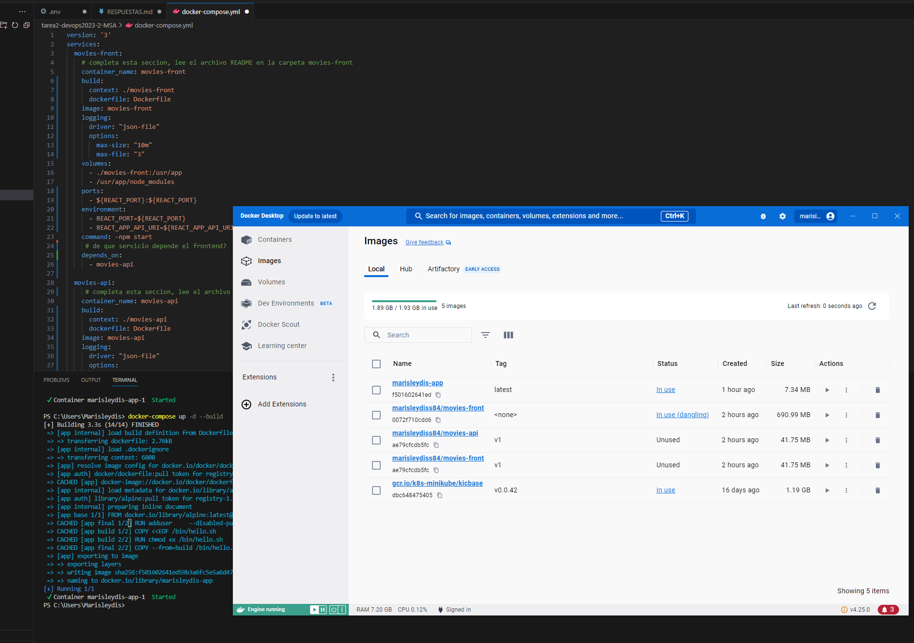

# Nombre: Marisleydis Socas Alvez
# Equipo 3
# Preguntas/Respuestas

1.- Revisa el contenido del directorio sql_migrations. ¿Cuál es la diferencia entre los archivos con el verbo Create con los archivos con el verbo Add?

Los archivos con el verbo Create contienen los scripts para crear las tablas directors y movies, mientras los archivos Add contienen los scripts para insertar 2 registros en cada una de las tablas anteriores.

2.- ¿Qué pasa si cambias el nombre del servicio de postgres a db? ¿Qué otros cambios tendrías que hacer?

Si se cambia el nombre del servicio postgres a db, es necesario cambiar la dependencia dentro de los servicios que dependen del postgres actualmente, habría que sustituir el postgres por db.

3.- Si quisieramos que el servicio movies-api use el puerto 81, ¿Qué cambios habría que hacer?

Para esto sería necesario cambiar el valor de la variable BIND_PORT en el .env y además se debe cambiar el valor del REACT_APP_API_URI a http://localhost:8081 en el archivo .env

4.- ¿Qué pasa si a la variable de ambiente `BIND_IP` le asignas el valor localhost?
Si hacemos esto tendríamos un conflicto para comunicarnos desde el front a la api, la api solo funcionaría dentro del mismo contenedor.

5.- Revisa el archivo `Dockerfile` en la carpeta `movies-api`. ¿Qué te llama la atención? Trata de explicar lo que ocurre en este caso.

Considero que está bien que se use el USER nonroot:nonroot pues con ello se pueden mitigar posibles vulnerabilidades en tiempo de ejecución.
Me llama la atención también que este archivo dockerfile es mucho más simple que el de la clase..

